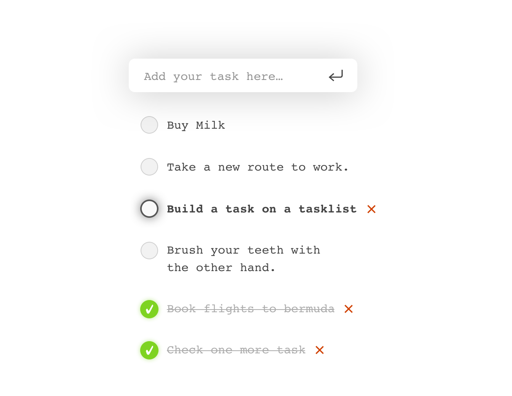

#### Hello 👋 I’m the Kaiser Coding Challenge

We at Kaiser X Labs love new ways of ideas and thinking, that's why we're really happy that you want to be a part of Kaiser X and work with us. 🙏🏻

We would like to get to know you and your talents better, therefore we have set up a little project so you can show us your strengths.

We work with innovative technologies and do a little bit more than just a regular "Hello World". However, we also have to work in a structured manner and have set ourselves the task of considering the well-known task list.

### The Challenge

At Kaiser X the javascript framework of choice is **Angular**, so also this challenge has to be built using it.
To have a good start with our challenge please create a new Angular project using the `angular-cli`.

Here you can see a design draft we've created to give you an idea of what we have in mind. It's not a pixel-perfect screen design but more a mockup or wireframe, which is supposed to guide you. You shouldn't need any assets to implement this, but we would of course happy about an appropriate Kaiser X look from you.🤴

The application has to fulfill the following requirements:

* Create at least the three components  `overview`, `add-task` and  `task`.

* Tasks can be created by the user from within the `add-task` component. New tasks appear on top of the list.

* In general a task can have the following states:
    - _todo_
    - _done_
    - _deleted_

* The user can mark every task as done.

* The user can delete every task, but they get a warning, which needs to confirmed, if the task hasn't been completed yet.

* For quick usage and accessibility we would prefer that the task list can also be controlled by keyboard.

* The usual visual states `:hover`, `:focus` and `:active` of all interactive elements need to be styled distinguishable.

* In general keep in mind, the tasks need to be persisted, so when you close the browser and open it again, the tasks cannot be lost.

We look forward to see your version of the tasks list – let’s start and happy coding 🚀🛠
